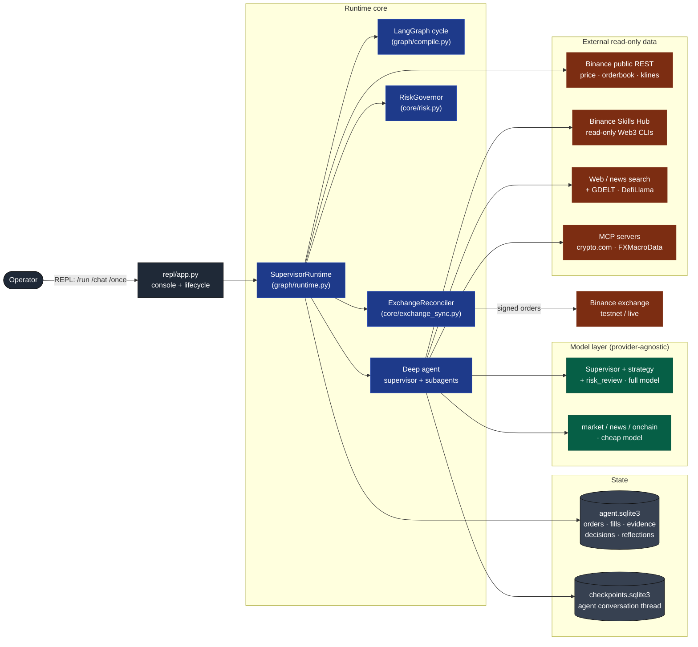
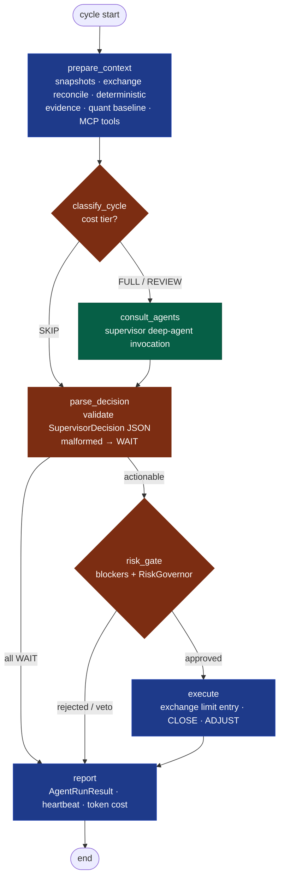
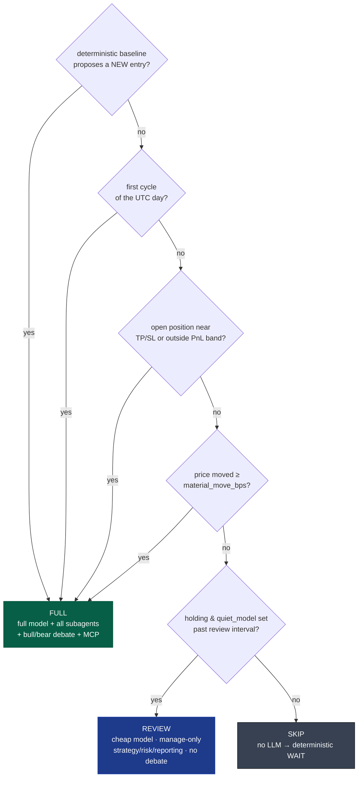
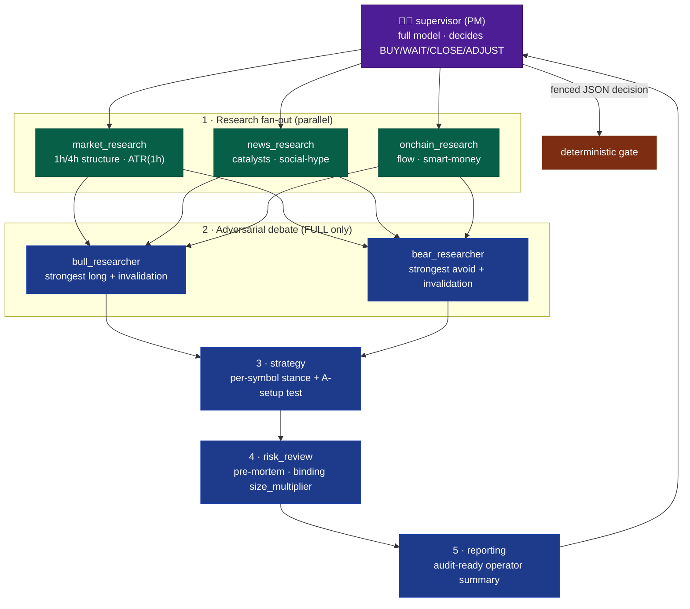
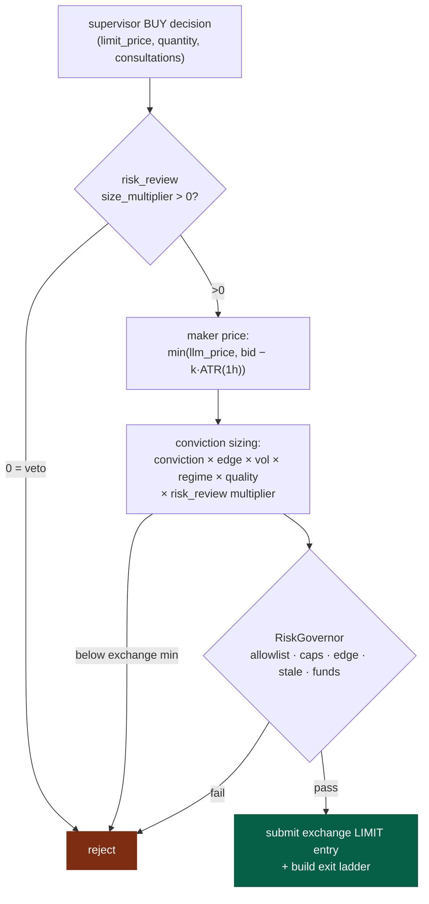
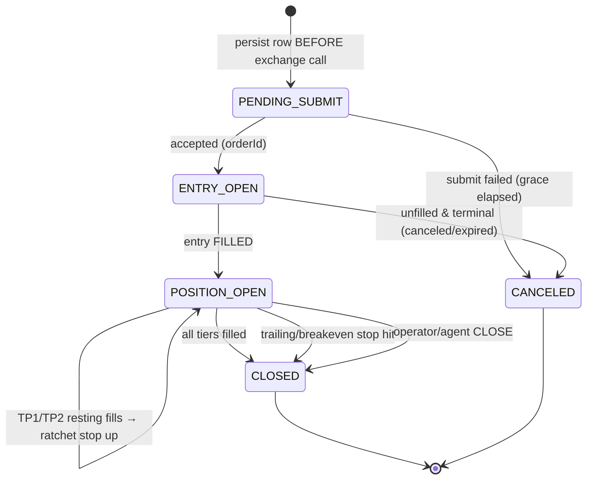
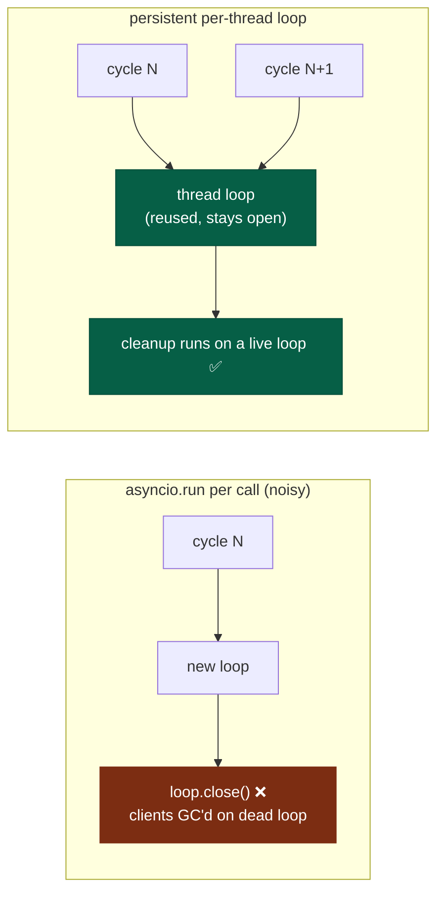

# Architecture

A **virtual professional trading desk**: specialist subagents do the research, a
supervisor *deep agent* acts as the Portfolio Manager and makes the final
`BUY / SELL / WAIT / CLOSE / ADJUST` call, and a **deterministic risk gate** can
veto or resize anything before it reaches the exchange.

The desk trades a coherent **hourly swing** style — it decides once per hour off
1h/4h structure and holds winners for hours-to-days on a trailing exit ladder. It
is *not* an intraday scalper; cadence, stop width, targets, and prompts are all
aligned to that style (see [Cadence & cost tiers](#cadence--cost-tiers) and
[Exit ladder](#exit-ladder--order-lifecycle)).

> Built on LangChain **deepagents** + **LangGraph**, driven by a Claude Code-style
> REPL. Execution modes: **testnet** (`testnet.binance.vision`) and **live**
> (`api.binance.com` / `api.binance.us`, multi-flag opt-in).

---

## 1. System context

How the operator, the runtime, the model layer, and the outside world connect.



Module layout (`src/trading_agent/graph/`):

| Module | Responsibility |
|---|---|
| `state.py` | `RuntimeGraphState`, `AgentRunResult` |
| `nodes.py` | `CycleNodes` — node implementations bound to runtime services |
| `edges.py` | wiring + conditional routers |
| `cadence.py` | `classify_cycle` — FULL / REVIEW / SKIP cost tier (pure) |
| `compile.py` | `build_cycle_graph` (compiled **without** a checkpointer — see §7) |
| `deep_agent.py` | supervisor/subagent construction, skills, mode-aware prompts |
| `streaming.py` | sync/async stream handling, observability events |
| `checkpointer.py` | `CheckpointerFactory` → `<HOME>/checkpoints.sqlite3` |
| `runtime.py` | `SupervisorRuntime` facade: wiring, `arun_once`, `achat`, `aintroduce` |

---

## 2. The cycle pipeline

Every decision cycle is a LangGraph `StateGraph`. The deterministic prep always
runs; the **expensive LLM fan-out runs only when the cadence tier warrants it**;
nothing reaches the exchange without passing the deterministic gate.



- **`prepare_context`** is fully deterministic and cheap — it runs *every* cycle:
  live snapshots, exchange reconcile, the three deterministic signal agents
  (`MarketDataAgent` / `NewsSentimentAgent` / `OnChainFlowAgent`), and the
  `StrategyAgent` quant baseline that proposes candidate entries.
- **`consult_agents`** is the only expensive step (the deep-agent fan-out). A
  `SKIP` tier bypasses it entirely and emits a deterministic WAIT.
- **`risk_gate`** and **`execute`** are deterministic — the LLM can never place an
  order directly. A parse/validation failure degrades every symbol to WAIT.

With `TRADING_AGENT_ENABLE_LLM_SUPERVISOR=false` the deterministic StrategyAgent
output is wrapped in `SupervisorDecision(source="deterministic")` so the graph
shape (and audit trail) is identical.

---

## 3. Cadence & cost tiers

`classify_cycle` ([graph/cadence.py](../src/trading_agent/graph/cadence.py)) decides
how much to spend *before* paying for the LLM. The fast bracket monitor manages
open-position exits every ~60s between cycles, so a `SKIP` never leaves a position
unmanaged.



Knobs live in `config.json` `cost.*` (`CostConfig`): `material_move_bps`,
`position_review_band_pct`, `bracket_proximity_pct`, `review_interval_minutes`,
`full_on_first_cycle_of_day`, and `quiet_model`. **`REVIEW` requires a
`quiet_model`**; with it unset the tiering is effectively FULL-or-SKIP.

---

## 4. The deep-agent desk (fan-out)

On a FULL cycle the supervisor runs the full professional workflow: parallel
research → adversarial debate → strategy synthesis → risk pre-mortem → reporting,
then emits the decision. Models are routed per role — cheap on the pure scorers,
full on the judgment seats.



| Role | Model (default) | Why |
|---|---|---|
| supervisor | full | final judgment + synthesis |
| strategy, risk_review | full | A-setup test, binding veto/size lever |
| bull / bear | full | adversarial reasoning quality matters |
| market / news / onchain | **cheap (`subagent_models`)** | tool-driven scoring, cost-dominant |
| reporting | full | must reason over cycle context, not hallucinate |

A `BUY` requires consultations from **all six** required subagents
(`decision.py::REQUIRED_AGENTS`) this cycle or it is auto-rejected. bull/bear are
*advisory* (not in `REQUIRED_AGENTS`) and run only on FULL cycles, so they add no
cost to cheap REVIEW cycles.

### Per-subagent model routing

Subagents inherit the supervisor model unless overridden via
`config.json` `model.subagent_models` (or env `TRADING_AGENT_SUBAGENT_MODELS`),
e.g. `{"market_research": "azure_openai:gpt-5.4-nano"}`. The runtime builds a
**model instance** per distinct identifier (not a bare `provider:model` string)
and **shares one client across subagents on the same deployment** — instances are
required for Azure (whose endpoint/api-version come from `Settings`, not the env
var LangChain's string resolver expects), and sharing keeps the per-cycle async
client count low (see §8). Unknown agent names are ignored with a warning.

---

## 5. Decision contract

The supervisor ends each cycle (and any actionable `/chat` reply) with a fenced
```json``` block matching `core/decision.py::SupervisorDecision`:

- **`BUY`** requires `limit_price`, `quantity`, and **consultations from all six
  required subagents** — otherwise rejected and treated as WAIT.
- **`CLOSE` / `SELL` / `ADJUST`** require the open order's `target_order_id`.
- **`evidence_refs`** must cite real evidence ids gathered this cycle (surfaced as
  `evidence_available` in the cycle context). A BUY citing ids that resolve to
  nothing is rejected (`require_evidence_refs`, default on) — this stops the LLM
  from fabricating its consultation trail. Operator `/chat` BUYs are bound to
  freshly gathered deterministic evidence before gating.
- **Parse/validation failure → WAIT** for every symbol. The LLM can never bypass
  the gate with malformed output.
- Every decision is persisted to `supervisor_decisions` with its gate outcome and
  executed order id.

---

## 6. The deterministic gate, sizing & maker entries

`CycleNodes._gate_buy` applies deterministic overrides so price and size never
depend on the LLM's exact numbers:



- **Hard maker discipline** (`hard_maker_entry`): the entry never chases. The
  applied price is `min(llm_price, maker_pullback_price)` where
  `maker_pullback_price = bid − entry_atr_mult·ATR(1h)` (clamped to the
  `[entry_min_offset_bps, entry_max_offset_pct]` band). A chase above the maker
  price is pulled back; a **deeper bid at charted support is honored** — the whole
  point of a swing pullback entry.
- **Conviction-scaled sizing** (`core/risk.py::conviction_size`,
  `SizingConfig`): notional scales with `conviction × edge`, de-risked by current
  volatility (ATR%), the macro regime, data quality, and the **binding
  `risk_review` `size_multiplier`** (`0` = veto). Below the exchange minimum it
  returns 0 → reject as too small. The same sizer feeds the deterministic
  baseline so both paths size identically.
- **Portfolio circuit breakers** (`RiskConfig`): `max_correlated_notional_usd`
  (BTC/ETH/SOL/BNB are one beta bet), `daily_loss_halt_pct` (halts new BUYs once
  the UTC day is down past the limit), `max_open_positions`, kill switch.
- **Breach vs veto**: a gate rejection is a *veto* (healthy). Only kill switch,
  daily-loss halt, live misconfig, and allowlist/no-evidence bugs count as
  *breaches* against the promotion gate.

---

## 7. Exit ladder & order lifecycle

Spot has no native bracket, so exits are deterministic. Each open position gets a
**tiered scale-out + ratcheting/trailing stop** (`core/exit_ladder.py`), managed
by `ExchangeReconciler` every cycle and by the fast bracket monitor every ~60s.



- **Swing-width bracket** (`ExitConfig`, `RiskConfig`): ~4% initial stop, TP tiers
  at +3% / +6% (scale out 40% / 30%), runner rides the rest on a trailing stop
  (`trail_atr_mult`·ATR(1h)). After TP1 the stop moves to breakeven; after TP2 it
  locks to the prior tier. The stop **only ever moves up**.
- **Real resting take-profits**: TP tiers are placed as actual LIMIT SELL orders
  so the venue fills them the instant price touches — no polling gap. A stop-out
  cancels the resting tiers and market-sells the remainder.
- **Crash-safe**: the order row is persisted as `PENDING_SUBMIT` *before* the
  exchange call, so a crash mid-submit leaves a `client_order_id` the reconciler
  adopts or discards on restart (no orphaned positions).
- **Per-trade PnL** (`core/pnl.py`): realized PnL is computed per round trip from
  **actual fills including commissions** (quote-asset fees exact; base-asset fees
  valued at fill price; BNB-discount fees converted at book price and flagged
  estimated) — never from portfolio deltas. Every final close also writes a
  deterministic **reflection** (outcome, R-multiple, exit reason, hold time) that
  later cycles read back via `recent_reflections` + `trade_stats`.

---

## 8. Async execution model

The REPL drives async work from sync entry points (`run_once`, `chat`) on a
couple of threads. Using `asyncio.run` per call creates **and closes** a fresh
event loop each time, so httpx async clients (LLM + MCP) get garbage-collected on
a dead loop → `RuntimeError: Event loop is closed` spam. The runtime instead uses
a **persistent per-thread loop** (`utils/aioloop.py::run_coro_blocking`), wired
into both `runtime._run_sync` and `mcp_tools.load_tools_sync` (the two
`asyncio.run` sites). The loop stays open for the thread's lifetime, so client
cleanup never targets a closed loop.



---

## 9. State, truth & checkpointing

- **Exchange is truth.** `ExchangeReconciler` treats the local `orders` table as a
  cache: every cycle (and `/orders --sync`) it pulls live status
  (`GET /api/v3/order`) and fills (`GET /api/v3/myTrades`) from the venue, manages
  the exit ladder, and recomputes PnL from fills.
- **Conversation memory** (supervisor + subagents + `/chat`) lives in
  `<HOME>/checkpoints.sqlite3` via LangGraph `AsyncSqliteSaver`, opened *per
  top-level async call* (aiosqlite connections are loop-bound). The **outer cycle
  graph is compiled without a checkpointer** — each run is a fresh pipeline whose
  state holds live Python objects; sharing one checkpointer thread between the
  outer graph and the nested deep agent corrupts both.
- **Operator state** (orders, fills, evidence, decisions, reflections, settings)
  lives in `<HOME>/agent.sqlite3`.

---

## 10. Market-data discipline

Agents get `get_price`, `get_orderbook_ticker`, and `get_klines` (OHLCV +
EMA/SMA/RSI/MACD/ATR/Bollinger) from `utils/market_data.py`. These **always hit
the production public API** — testnet tickers diverge from the real market, which
previously caused agents to quote prices that did not match the charts. Prompts
forbid price claims from news, memory, or narrative. ATR for entry/stop sizing is
taken on `risk.atr_interval` (**1h**, the swing horizon). Order *execution* uses
`Settings.exchange_base_url()` (testnet.binance.vision for testnet, api.binance.com
/ api.binance.us for live).

Research payloads are trimmed for the LLM: Binance Skills Hub JSON is rounded to
~8 sig figs and long leaderboards capped (`binance_skills._compact_skill_stdout`),
and fetched pages strip image/asset links (`web_search._strip_page_noise`).

---

## 11. Honest evidence & down-weighting

Not all live sources are equal (`core/models.py::EvidenceRecord.quality`): a
primary source (exchange feed, Binance skills hub) earns full weight; a degraded
fallback (broad web news, coarse TVL proxy) is real but weighted down
(`quality < 1.0`) in `StrategyAgent` scoring and feeds a data-quality haircut into
`conviction_size`. **Placeholders** (synthesized when a live source is down) are
fully excluded (`quality == 0`) and hard-rejected by the RiskGovernor — synthetic
scores can never drive an order. On-chain BSC leaderboards are framed as
attention/narrative, not spot flow.

---

## 12. Execution modes

| Mode | Orders | Opt-in |
|---|---|---|
| `testnet` | real orders on testnet.binance.vision | `TRADING_AGENT_EXECUTION_MODE=testnet`, `TRADING_AGENT_ENABLE_TESTNET_ORDERS=true`, `BINANCE_VENUE=testnet`, keys |
| `live` | **real money** | `TRADING_AGENT_EXECUTION_MODE=live`, `TRADING_AGENT_ENABLE_LIVE_ORDERS=true`, `BINANCE_VENUE=binance.com\|binance.us`, keys, config.json `live.enabled` + `live.venue_confirmed`; autonomous cycle orders additionally need `live.auto_orders_within_caps=true`, otherwise only operator-confirmed `/chat` orders |

Local paper execution has been removed from the operational path.

---

## 13. MCP research tools

`utils/mcp_tools.py` loads read-only remote MCP servers each cycle and hands their
tools to the supervisor and research subagents. Enabled by default:
**crypto.com market-data** (prices/rankings/trending) and **FXMacroData**
(FX/rates/COT/macro regime). Servers load in isolation with a 20s timeout (one bad
endpoint can't stall a cycle); execution-named tools are filtered out; a
`tool_allowlist` in `mcp_servers.json` trims the schema footprint. See
[mcp.md](mcp.md). `trading-agent mcp-check` probes reachability.

---

## 14. LLM cost accounting

A `UsageMetadataCallbackHandler` on the cycle invoke captures token usage across
the supervisor and **all** subagents (callbacks propagate through
`subgraphs=True`). `CycleNodes._record_token_usage` prices it via
`utils/token_cost.py`, logs per-cycle and cumulative spend, persists the running
total, and surfaces it in `report` (`llm_cost`). The promotion gate requires
positive net PnL **after LLM cost**, zero real breaches, and a minimum closed-trade
sample (`LiveConfig.promotion_min_closed_trades`).

---

## 15. Validation: deterministic & LLM backtests

- **`backtest.py`** replays historical klines through the deterministic pipeline
  (MarketDataAgent → StrategyAgent → RiskGovernor) vs buy-and-hold / WAIT-always.
- **`decision_replay.py`** (`backtest-decisions`) replays the supervisor's
  **recorded** BUY decisions through the shared fill/fee/slippage model against the
  real forward price path — the only way the LLM trader's decisions get scored.
  Both share the trade simulator so they are apples-to-apples.
